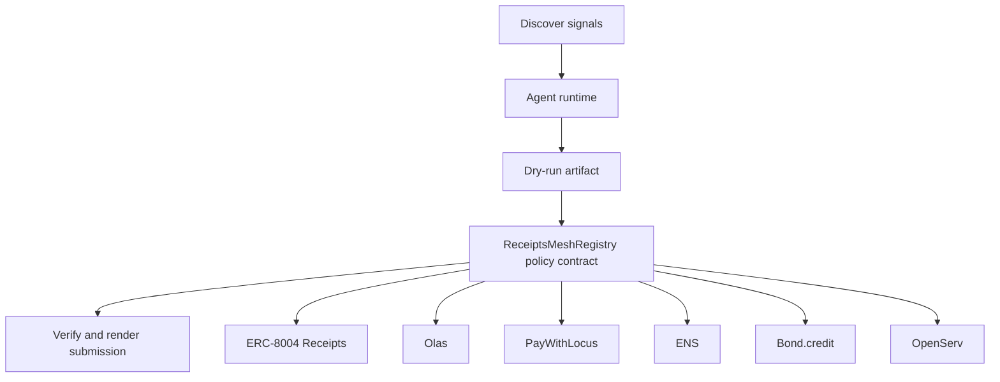

# ReceiptsMesh Reputation Market

- **Repo:** `Synthesis-ERC8004-Receipts`
- **Primary track:** Agents With Receipts
- **Category:** identity
- **Submission status:** implementation ready, waiting for credentials and TxIDs.

A receipts-native identity and reputation rail for swarms that hire each other, settle work, and publish onchain usage evidence.

## Selected concept

A receipt registry models identity anchors, operator wallets, reputation updates, and task receipts with machine-readable metadata. Python tooling assembles receipt payloads, verifies schemas, and keeps agent.json and agent_log.json aligned with future live registrations.

## Idea shortlist

1. Reputation-Gated Agent Marketplace
2. Credit-Scored Trading Agent
3. ENS-Only Reputation Exchange

## Partners covered

ERC-8004 Receipts, Olas, PayWithLocus, ENS, Bond.credit, OpenServ, Bankr Gateway

## Architecture



## Repository layout

- `src/`: shared policy contracts plus the repo-specific wrapper contract.
- `script/`: Foundry deployment entrypoint.
- `agents/`: Python runtime, partner adapters, and project metadata.
- `scripts/`: CLI utilities for running the loop and rendering submissions.
- `docs/`: architecture, credentials, demo script, and security notes.
- `submissions/`: generated `synthesis.md` snippet for this repo.

## Action catalog

| Action | Partner | Purpose | Max USD | Sensitivity |
| --- | --- | --- | --- | --- |
| `erc_8004_receipts_receipt_anchor` | ERC-8004 Receipts | Use ERC-8004 Receipts for a bounded action in this repo. | $1 | medium |
| `olas_market_hire` | Olas | Use Olas for a bounded action in this repo. | $20 | medium |
| `paywithlocus_subaccount_pay` | PayWithLocus | Use PayWithLocus for a bounded action in this repo. | $120 | medium |
| `ens_ens_publish` | ENS | Use ENS for a bounded action in this repo. | $5 | low |
| `bond_credit_credit_trade` | Bond.credit | Use Bond.credit for a bounded action in this repo. | $90 | high |
| `openserv_job_dispatch` | OpenServ | Use OpenServ for a bounded action in this repo. | $10 | medium |
| `bankr_gateway_compute_route` | Bankr Gateway | Use Bankr Gateway for a bounded action in this repo. | $10 | high |

## Commands

```bash
python3 -m unittest discover -s tests
forge test
python3 scripts/run_agent.py
python3 scripts/plan_live_demo.py
python3 scripts/render_submission.py
```

## Credentials

| Partner | Variables | Docs |
| --- | --- | --- |
| ERC-8004 Receipts | RPC_URL | https://eips.ethereum.org/EIPS/eip-8004 |
| Olas | OLAS_API_KEY, OLAS_REQUEST_URL | https://docs.olas.network/ |
| PayWithLocus | LOCUS_API_KEY, LOCUS_PAYMENT_URL | https://docs.locus.finance/ |
| ENS | ENS_NAME | https://docs.ens.domains/ |
| Bond.credit | GMX_ORDER_URL, BOND_CREDIT_PROFILE_URL | https://bond.credit/ |
| OpenServ | OPENSERV_API_KEY, OPENSERV_AGENT_URL | https://docs.openserv.ai/ |
| Bankr Gateway | BANKR_API_KEY, BANKR_CHAT_COMPLETIONS_URL, BANKR_MODEL | https://bankr.bot/ |

## Live demo plan

1. Copy .env.example to .env and fill the required keys.
2. Deploy the contract with forge script script/Deploy.s.sol --broadcast for ReceiptsMeshRegistry.
3. Run python3 scripts/run_agent.py to produce a dry run for receipts_mesh.
4. Set LIVE_MODE=true and rerun python3 scripts/run_agent.py with real credentials.
5. Run python3 scripts/render_submission.py and attach TxIDs plus repo links.
